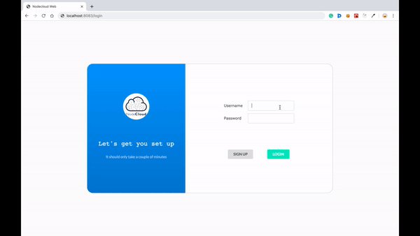

<p align="center">
  
</p>

# nodecloud-web

nodecloud-web provides an interactive front-end for [nodecloud](https://github.com/cloudlibz/nodecloud). NodeCloud is a standard library to get a single API on the open cloud with multiple providers.
Making open cloud easily accessible and managed.



# clone or download

```sh
$ git clone https://github.com/cloudlibz/nodecloud-web.git
$ npm i
```

# Project Structure

```
server/
   package.json
   .env (to create .env, check [prepare your secret session])
client/
   package.json
...
```

# Usage (run fullstack app on your machine)

# Client Side (PORT: 8081)

```sh
$ cd client   // go to client folder
$ npm i       // npm install pacakges

// deployment for client app
$ npm start // this will compile the react code using webpack and run them at port 8081 by default
```

# Server Side (PORT: 4000)

# Prepare your secret

You need to add a JWT_SECRET in .env

# Start

```sh
$ cd server   // go to server folder
$ npm i       // npm install pacakges
$ npm run // this will build the server code
```

# Docker

```sh
$ cd nodecloud-web
$ docker-compose up
```

# API Documentation

[API docs](https://app.swaggerhub.com/apis/amrita019/nodecloud-web/1.0.0)

# Screenshots

<p align="center">
  
</p>
<p align="center">
  
</p>
<p align="center">
  
</p>

# License

MIT
